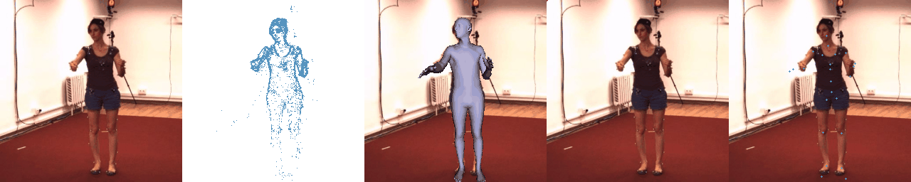

# HumanPoseTracking_SNN
Event-based Human Pose Tracking using Spiking Spatiotemporal Transformer, submitted to IEEE TPAMI 2023.


### Conda Environment Setup
```
conda create --name snn python=3.9

# cuda 10.2, latest GPU model such as A100 may not support cuda 10.2
conda install pytorch==1.12.1 torchvision==0.13.1 torchaudio==0.12.1 cudatoolkit=10.2 -c pytorch
pip install cupy-cuda102

# cuda 11.6
conda install pytorch torchvision torchaudio pytorch-cuda=11.6 -c pytorch -c nvidia
pip install cupy-cuda11x

# install SpikingJelly, git checkout version in Nov 2022
cd ~
git clone https://github.com/fangwei123456/spikingjelly.git
cd spikingjelly
git checkout df8470b2b339aa0c05aa4885d615956a95a245b2
python setup.py install


# install opendr, you can use other tools for rendering of SMPL shape such as pytorch3d or pyrender
sudo apt-get install libglu1-mesa-dev freeglut3-dev mesa-common-dev
sudo apt-get install libosmesa6-dev
pip install opendr

# other dependencies
pip install opencv-python
pip install joblib
pip install plyfile
```

### model and test
Pretrained models can be downloaded from [Google Drive](https://drive.google.com/drive/folders/1mg9fgDLdQHBifkWjPDo1t1X8KUvy0SQS?usp=sharing).
Put the pretrained models in ```./data/pretrained_model```
```
cd model_snn
bash run_test.sh
```

## Test examples (model of 8 and 64 time steps)


## Dataset
### Test samples
We provide a subset of test samples from MMHPSD dataset. [Google Drive](https://drive.google.com/drive/folders/1Z2wBWeYL0qcKYQiC5Vj9SlJnUfpvnRP4?usp=share_link)
### We will release our dataset upon paper acceptance. Below are some samples from the dataset.





## Citation
```
@article{zou2023event,
  title={Event-based Human Pose Tracking by Spiking Spatiotemporal Transformer},
  author={Zou, Shihao and Mu, Yuxuan and Zuo, Xinxin and Wang, Sen and Cheng, Li},
  journal={arXiv preprint arXiv:2303.09681},
  year={2023}
}
```
